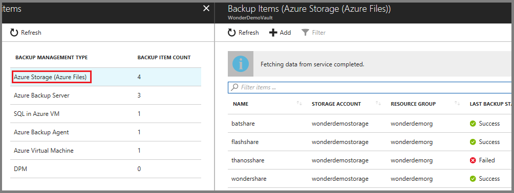
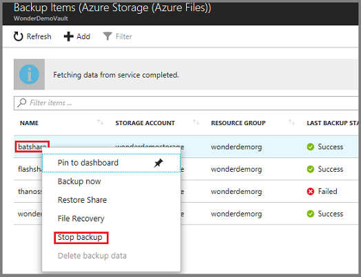
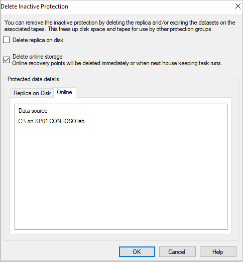
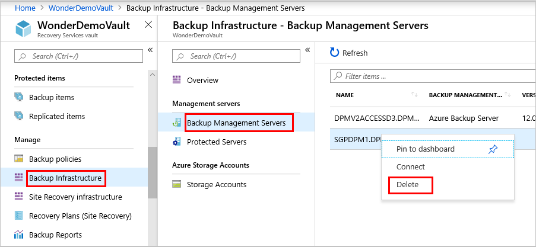
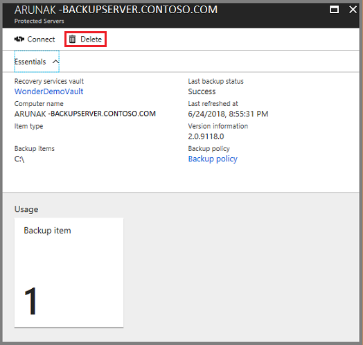

# Delete a Recovery Services vault

This article describes how to delete an [Azure Backup](backup-overview.md) Recovery Services vault. It contains instructions for removing dependencies and then deleting a vault, and deleting a vault by force.


## Before you start

Before you start, it's important to understand that you can't delete a Recovery Services vault that has servers registered in it, or that holds backup data.

- To gracefully delete a vault, unregister servers it contains, remove vault data, and then delete the vault.
- If you try to delete a vault that still has dependencies, an error message is issued, and you will need to manually remove the vault dependencies, including:
    - Backed up items
    - Protected servers
    - Backup management servers (Azure Backup Server, DPM)
- If you don't want to retain any data in the Recovery Services vault, and want to delete the vault, you can delete the vault by force.
- If you try to delete a vault, but can't, the vault is still configured to receive backup data.


## Delete a vault from the Azure portal

1. Open the vault dashboard.  
2. In the dashboard, click **Delete**. Verify that you want to delete.

    

If you receive an error, remove [backup items](#remove-backup-items), [infrastructure servers](#remove-azure-backup-management-servers), and [recovery points](#remove-azure-backup-agent-recovery-points), and then delete the vault.


## Delete the Recovery Services vault using Azure Resource Manager client

[!INCLUDE [updated-for-az](../../includes/updated-for-az.md)]

1. Install chocolatey from [here](https://chocolatey.org/) and to install ARMClient run the below command:

   `choco install armclient --source=https://chocolatey.org/api/v2/`
2. Sign in to your Azure account, and run this command:

    `ARMClient.exe login [environment name]`

3. In the Azure portal, gather the subscription ID and resource group name for the vault you want to delete.

For more information on ARMClient command, refer this [document](https://github.com/projectkudu/ARMClient/blob/master/README.md).

### Use Azure Resource Manager client to delete Recovery Services vault

1. Run the following command using your subscription ID, resource group name, and vault name. When you run the command it deletes the vault if you don’t have any dependencies.

   ```
   ARMClient.exe delete /subscriptions/<subscriptionID>/resourceGroups/<resourcegroupname>/providers/Microsoft.RecoveryServices/vaults/<recovery services vault name>?api-version=2015-03-15
   ```
2. If the vault's not empty, you receive the error "Vault cannot be deleted as there are existing resources within this vault". To remove a protected items / container within a vault, do the following:

   ```
   ARMClient.exe delete /subscriptions/<subscriptionID>/resourceGroups/<resourcegroupname>/providers/Microsoft.RecoveryServices/vaults/<recovery services vault name>/registeredIdentities/<container name>?api-version=2016-06-01
   ```

3. In the Azure portal, verify that the vault is deleted.


## Remove vault items and delete the vault

Remove all the dependencies before the Recovery Services vault is deleted.

### Remove backup items

This procedure provides an example that shows you how to remove backup data from Azure Files.

1. Click **Backup Items** > **Azure Storage (Azure Files)**

    

2. Right-click each Azure Files item to remove, and click  **Stop backup**.

    


3. In **Stop Backup** > **Choose an option**, select **Delete Backup Data**.
4. Type the name of the item, and click **Stop backup**.
   - This verifies that you want to delete the item.
   - The **Stop Backup** button activates after you verify.
   - If you retain and don't delete the data, you won't be able to delete the vault.

     

5. Optionally, provide a reason why you're deleting the data, and add comments.
6. To verify that the delete job completed, check the Azure Messages .
7. After the job completes, the service sends a message: **the backup process was stopped and the backup data was deleted**.
8. After deleting an item in the list, on the **Backup Items** menu, click **Refresh** to see the items in the vault.

      

## Deleting backup items from management console

To delete the backup items from Backup Infrastructure, navigate to your on-premises server Management Console (MARS, Azure Backup Server or SC DPM depending on where your back items are protected).

### For MARS agent

- Launch the MARS Management console, go to the **Actions** pane and choose **Schedule Backup**.
- From **Modify or Stop a Scheduled Backup** wizard, choose the option **Stop using this backup schedule and delete all the stored backups** and click **Next**.

    

- From **Stop a Scheduled Backup** wizard, click **Finish**.

    
- You are prompted to enter a Security Pin. To generate the PIN, perform the below steps:
  - Sign in to the Azure portal.
  - Browse to **Recovery Services vault** > **Settings** > **Properties**.
  - Under **Security PIN**, click **Generate**. Copy this PIN.(This PIN is valid for only five minutes)
- In the Management Console (client app) paste the PIN and click **Ok**.

  

- In the **Modify Backup Progress** wizard you will see *Deleted backup data will be retained for 14 day. After that time, backup data will be permanently deleted.*  

    

Now that you have deleted the backup items from on-premises, complete the below steps from the portal:
- For MARS follow the steps in [Remove Azure Backup agent recovery points](#remove-azure-backup-agent-recovery-points)

### For MABS agent

There are different methods to stop/delete online protection, perform any one of the below methods:

**Method 1**

Launch the **MABS Management** console. In the **Select data protection method** section, un-select **I want online protection**.

  

**Method 2**

To delete a protection group, you must first stop protection of the group. Use the following procedure to stop protection and enable deletion of a protection group.

1.	In DPM Administrator Console, click **Protection** on the navigation bar.
2.	In the display pane, select the protection group member that you want to remove. Right-click to choose **Stop Protection of Group Members** option.
3.	From the **Stop Protection** dialog box, select **Delete protected data** > **Delete storage online** checkbox and then click **Stop Protection**.

    

The protected member status is now changed to **Inactive replica available**.

5. Right-click the inactive protection group and select **Remove inactive protection**.

    

6. From the **Delete Inactive Protection** window, select **Delete online storage** and click **Ok**.

    

Now that you have deleted the backup items from on-premises, complete the below steps from the portal:
- For MABS and DPM follow the steps in [Remove Azure Backup management servers](#remove-azure-backup-management-servers).


### Remove Azure Backup management servers

Before removing the Azure backup management server, make sure to perform the steps listed in [Deleting backup items from management console](#deleting-backup-items-from-management-console).

1. In the vault dashboard menu, click **Backup Infrastructure**.
2. Click **Backup Management Servers** to view servers.

    

3. Right-click the item > **Delete**.
4. On the **Delete** menu, type the name of the server and click **Delete**.

     
5.  Optionally, provide a reason why you're deleting the data, and add comments.

> [!NOTE]
> If you are seeing the below error, then first perform the steps listed in [Deleting backup items from management console](#deleting-backup-items-from-management-console).
>
>
>
> If you are unable to perform the steps to delete backups from the management console, for example, due to unavailability of the server with the management console, contact Microsoft support.

6. To verify that the delete job completed, check the Azure Messages .
7. After the job completes, the service sends a message: **the backup process was stopped and the backup data was deleted**.
8. After deleting an item in the list, on the **Backup Infrastructure** menu, click **Refresh** to see the items in the vault.


### Remove Azure Backup agent recovery points

Before removing the Azure backup recovery point, make sure to perform the steps listed in [Deleting backup items from management console](#deleting-backup-items-from-management-console).

1. In the vault dashboard menu, click **Backup Infrastructure**.
2. Click **Protected Servers** to view the infrastructure servers.

    

3. In the **Protected Servers** list, click Azure Backup Agent.

    

4. Click the server in the list of servers protected using Azure Backup agent.

    

5. On the selected server dashboard, click **Delete**.

    

6. On the **Delete** menu, type the name of the server, and click **Delete**.

     

7. Optionally, provide a reason why you're deleting the data, and add comments.

> [!NOTE]
> If you are seeing the below error, then first perform the steps listed in [Deleting backup items from management console](#deleting-backup-items-from-management-console).
>
>
>
> If you are unable to perform the steps to delete backups from the management console, for example, due to unavailability of the server with the management console, contact Microsoft support.

8. To verify that the delete job completed, check the Azure Messages .
9. After deleting an item in the list, on the **Backup Infrastructure** menu, click **Refresh** to see the items in the vault.


### Delete the vault after removing dependencies

1. When all dependencies have been removed, scroll to the **Essentials** pane in the vault menu.
2. Verify that there aren't any **Backup items**, **Backup management servers**, or **Replicated items** listed. If items still appear in the vault, remove them.

3. When there are no more items in the vault, on the vault dashboard click **Delete**.

    

4. To verify that you want to delete the vault, click **Yes**. The vault is deleted and the portal returns to the **New** service menu.

## What if I stop the backup process but retain the data?

If you stop the backup process but accidentally retain the data, you must delete the backup data as described in the previous sections.

## Next steps

[Learn about](backup-azure-recovery-services-vault-overview.md) Recovery Services vaults.
